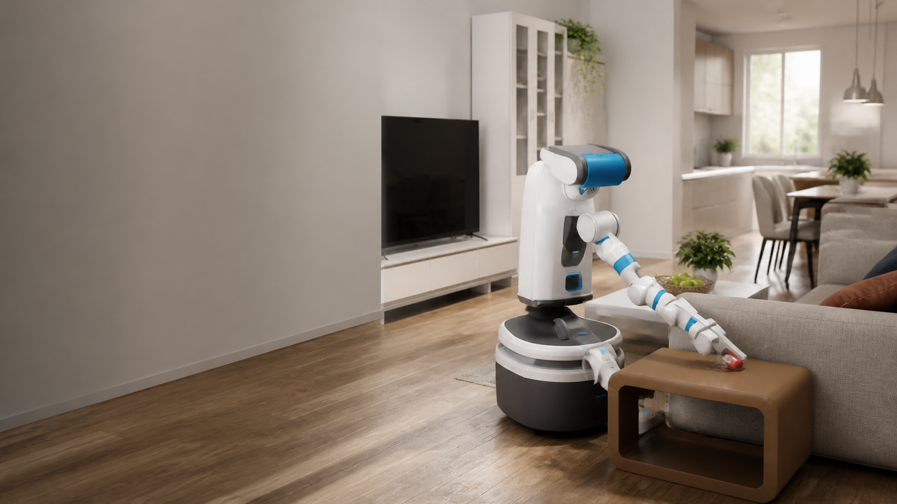
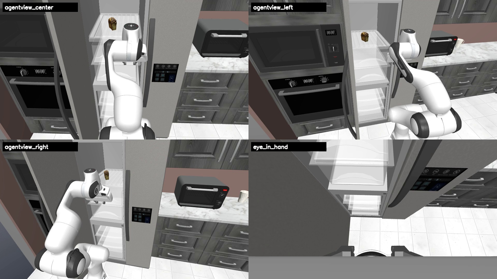
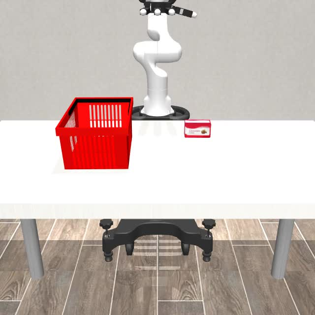
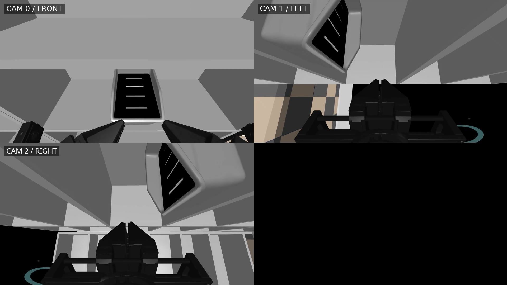
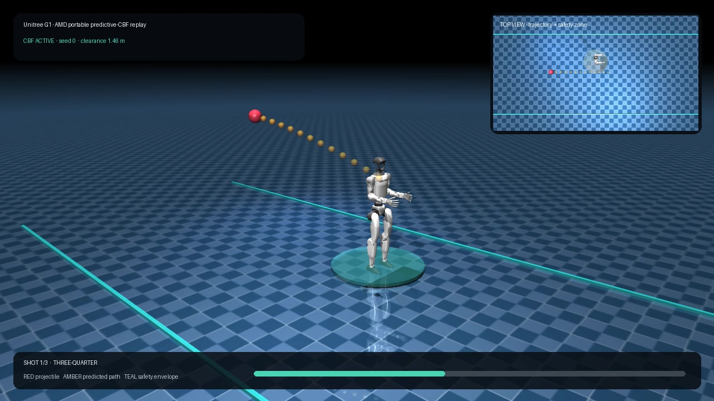
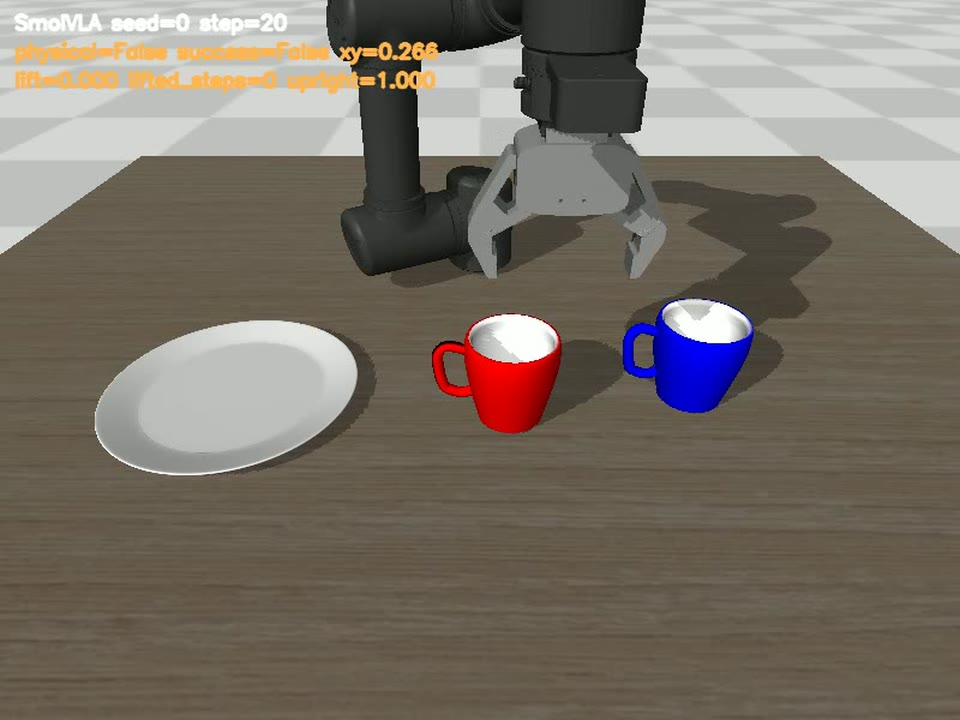

# Radeon Physical AI Evidence Suite

<p align="center">
  
</p>

<p align="center">
  <strong>One AMD-native workflow for household manipulation, dexterous control, simulation, rendering, and robot safety.</strong>
</p>

<p align="center">
  
  
  
  
</p>

<p align="center">
  <a href="https://ethan-chen-plus.github.io/amd-physical-ai-showcase/"><strong>Live Showcase</strong></a> ·
  <a href="https://ethan-chen-plus.github.io/amd-physical-ai-showcase/assets/videos/amd-physical-ai-demo-en.mp4"><strong>4:59 Demo Film</strong></a> ·
  <a href="output/pdf/datawhale-eai-radeon-physical-ai-technical-report.pdf"><strong>Technical Report</strong></a> ·
  <a href="docs/REPRODUCIBILITY.md"><strong>Reproduce on AMD</strong></a>
</p>

**Track 3 - Physical AI | Datawhale-EAI | AMD AI DevMaster Hackathon 2026**

Radeon Physical AI Evidence Suite is a reproducible collection of robot-learning,
simulation, and safety-control workflows running on AMD Radeon hardware through
ROCm. It connects model training, closed-loop evaluation, multi-view video,
hardware telemetry, and SHA-pinned evidence across household manipulation,
dexterous tasks, simulator migration, and predictive collision avoidance.

## Review in Three Paths

| Path | What it provides | Entry point |
|---|---|---|
| Interactive | Success-first task gallery, benchmark tables, migration case studies, and downloadable evidence | [Open the live showcase](https://ethan-chen-plus.github.io/amd-physical-ai-showcase/) |
| Deterministic | Validate result JSON, release files, and SHA-256 integrity without a GPU | `python3 scripts/validate_public_bundle.py` |
| Visual | A 4:59 English film assembled from real closed-loop task footage | [Watch the 1080p demo](https://ethan-chen-plus.github.io/amd-physical-ai-showcase/assets/videos/amd-physical-ai-demo-en.mp4) |

## Visual Evidence

<table>
  <tr>
    <td width="50%">
      <br />
      <strong>RoboCasa365 household manipulation</strong><br />
      GR00T and Pi0.5 evaluated under the same 16-task, 800-episode protocol.
    </td>
    <td width="50%">
      <br />
      <strong>DexJoCo dexterous control</strong><br />
      Native ROCm JAX 0.10 inference across eleven dexterous-hand tasks.
    </td>
  </tr>
  <tr>
    <td width="50%">
      <br />
      <strong>DISCOVERSE simulation and rendering</strong><br />
      Three synchronized 1080p views with task predicates and replay artifacts.
    </td>
    <td width="50%">
      <br />
      <strong>PAC-MAN whole-body safety control</strong><br />
      Duck and sidestep responses driven by an upstream 960-D to 29-joint policy.
    </td>
  </tr>
  <tr>
    <td width="50%">
      <br />
      <strong>Every Embodied SmolVLA</strong><br />
      A protected checkpoint reaches 57/60 strict physical successes.
    </td>
    <td width="50%">
      <br />
      <strong>Household mobile manipulation</strong><br />
      A unified task surface for navigation, approach, grasp, transport, and placement.
    </td>
  </tr>
</table>

[AMD environment matrix](docs/ENVIRONMENT_MATRIX.md) ·
[Evidence manifest](evidence/README.md) ·
[Contribution boundary](docs/CONTRIBUTIONS.md)

## Highlights

| Workstream | AMD execution | Result |
|---|---|---|
| Every Embodied SmolVLA | W7900 training, Ryzen AI MAX+ 395 evaluation | **57/60** strict physical successes; red 27/30, blue 30/30 |
| RoboCasa365 | Ryzen AI MAX+ 395, PyTorch and ROCm | GR00T **230/800** and Pi0.5 **142/800** over the same 16 tasks x 50 episodes |
| DexJoCo Pi0.5 | Ryzen AI MAX+ 395, ROCm JAX 0.10 | **5/11** at official seed 0; first-success search found reproducible successes for 10/11 tasks |
| DISCOVERSE | Ryzen AI MAX+ 395, ROCm | 18/18 runtime gates, AIRBOT 12/12, MMK2 8/8, four 1080p three-view task videos |
| Predictive CBF for Unitree G1 | Ryzen AI MAX+ 395, ROCm Torch and MuJoCo | 8/8 fixed-seed collision-avoidance replays; minimum clearance 0.422 m |

The suite also includes the official PandaOmron 12-D mobile-manipulation action
contract, RoboWits ACT training and evaluation tooling, native ROCm JAX setup,
3D Gaussian Splatting validation, and an English evidence website.

## System

```text
Robot tasks and datasets
        |
        v
RoboCasa365 | DexJoCo | DISCOVERSE | Every Embodied | PAC-MAN
        |
        v
AMD runtime adapters
PyTorch ROCm | JAX ROCm | MuJoCo/EGL | Genesis AMD | 3DGS
        |
        v
Training and inference
SmolVLA | Pi0/Pi0.5 | ACT | GR00T | Predictive CBF
        |
        v
Evaluation and evidence
fixed seeds | task predicates | JSON | video | telemetry | SHA-256
```

## Repository Layout

```text
components/             Integration notes for each Physical AI workstream
code/                   Compact original AMD controller and replay code
scripts/                AMD setup, data, training, evaluation, and profiling tools
docs/                   Reproduction, architecture, results, and contribution notes
evidence/               Public result JSON and release manifests
output/pdf/             English technical report
submission/             Official Track 3 submission index and PR body
```

The media-rich showcase is maintained separately so this source repository stays
reviewable:

- Website repository: <https://github.com/Ethan-Chen-plus/amd-physical-ai-showcase>
- Published site: <https://ethan-chen-plus.github.io/amd-physical-ai-showcase/>
- Public model repositories:
  [SmolVLA](https://huggingface.co/Datawhale/every-embodied-smolvla-mujoco-pnp),
  [Pi0](https://huggingface.co/Datawhale/every-embodied-pi0-mujoco-pnp),
  [ACT](https://huggingface.co/Datawhale/every-embodied-act-mujoco-pnp), and
  [RoboWits ACT](https://huggingface.co/Datawhale/robowits-act-amd-rocm).

## Reproduce

Start with the deterministic evidence check:

```bash
python3 scripts/validate_public_bundle.py
```

Then select a workflow from [docs/REPRODUCIBILITY.md](docs/REPRODUCIBILITY.md).
The guide records the AMD hardware, environment, dependency, dataset, training,
evaluation, and expected-output contracts. Large checkpoints and datasets are
downloaded from their public hosts rather than committed to Git.

The exact framework split used for the release is summarized in
[docs/ENVIRONMENT_MATRIX.md](docs/ENVIRONMENT_MATRIX.md).

## AMD Platforms

| Platform | Main role |
|---|---|
| AMD Radeon PRO W7900 | SmolVLA and ACT training, long-running policy workloads |
| AMD Ryzen AI MAX+ 395 | ROCm PyTorch/JAX inference, closed-loop evaluation, simulation, rendering, profiling |

ROCm software versions are recorded per workflow in the report and evidence
manifests. The JAX path uses the AMD ROCm 7.14 / JAX 0.10 pip environment; the
Every Embodied PyTorch path records PyTorch 2.11.0 with HIP 7.13.

## Team

**Kewei Chen - project lead and primary maintainer.** Responsibilities include
system architecture, AMD ROCm and JAX migration, simulator integration, model
training and evaluation, evidence validation, technical writing, demo video,
and the public showcase.

Datawhale community projects and upstream robotics repositories are credited in
[THIRD_PARTY_NOTICES.md](THIRD_PARTY_NOTICES.md). Original integration scripts
in this repository are released under the Apache License 2.0.
